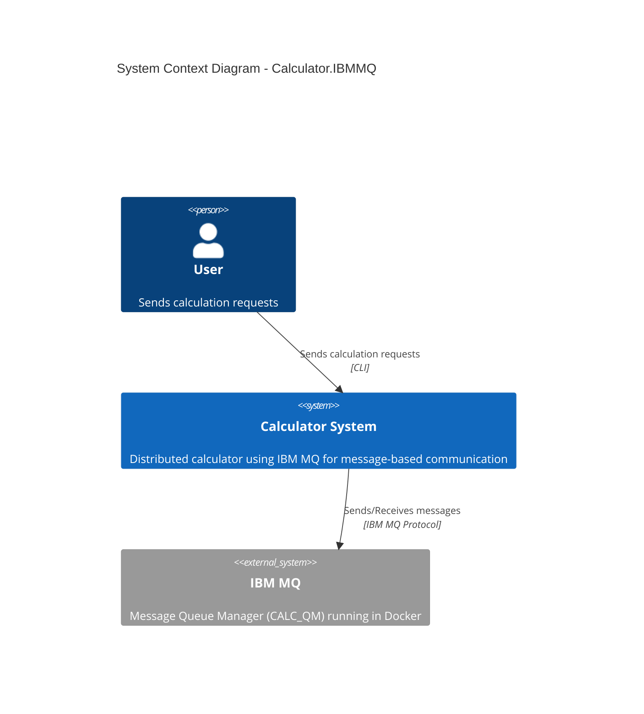
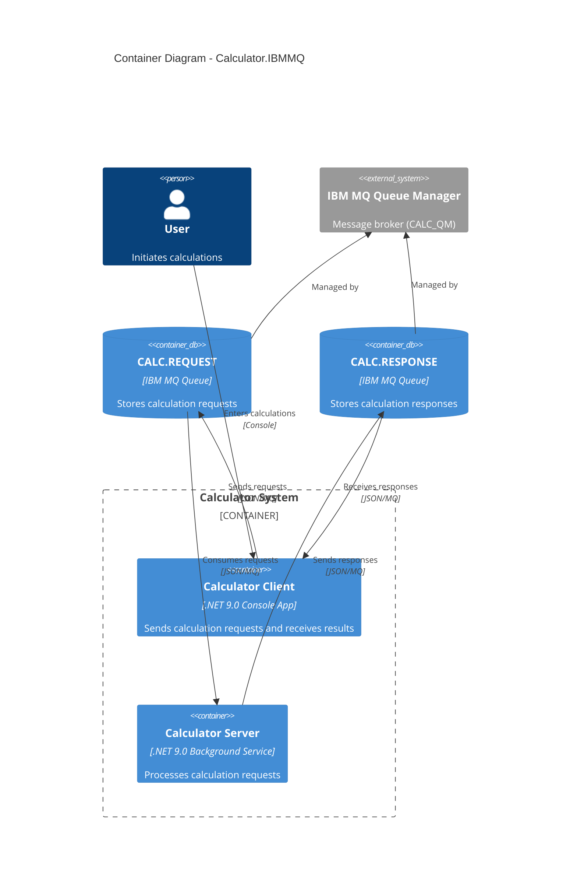
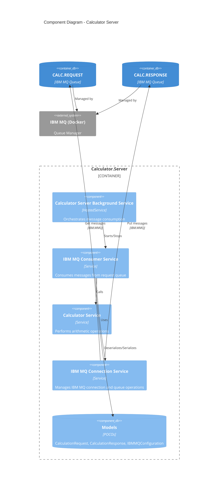
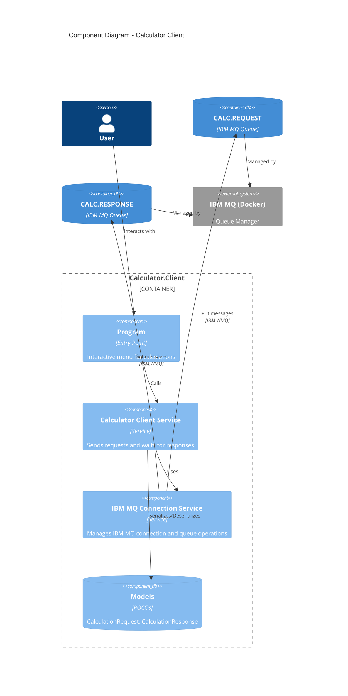
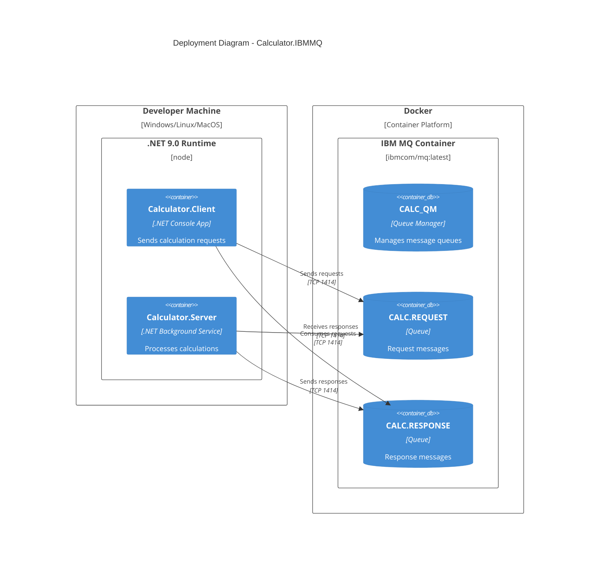

# Calculator.IBMMQ - C4 Architecture Diagram

## System Context Diagram (Level 1)

## Container Diagram (Level 2)

## Component Diagram (Level 3) - Calculator Server

## Component Diagram (Level 3) - Calculator Client

## Deployment Diagram

## Technology Stack

### Calculator Client & Server
- **Framework**: .NET 9.0
- **Language**: C#
- **IBM MQ Client**: IBMMQDotnetClient v9.4.4
- **Serialization**: System.Text.Json
- **Logging**: Microsoft.Extensions.Logging

### IBM MQ Infrastructure
- **Container**: Docker (ibmcom/mq:latest)
- **Queue Manager**: CALC_QM
- **Channel**: DEV.APP.SVRCONN
- **Queues**: CALC.REQUEST, CALC.RESPONSE
- **Port**: 1414 (MQ), 9443 (Web Console)

## Message Flow

1. **User** enters calculation (e.g., "5 + 3") in **Calculator.Client**
2. **Client** creates `CalculationRequest` JSON message with:
   - Operand1, Operand2
   - Operation (Add/Subtract/Multiply/Divide)
   - CorrelationId (for response matching)
   - ReplyTo: "CALC.RESPONSE"
3. **Client** puts message on **CALC.REQUEST** queue
4. **Server** gets message from **CALC.REQUEST** queue
5. **Server** performs calculation
6. **Server** creates `CalculationResponse` JSON with result
7. **Server** puts response on **CALC.RESPONSE** queue
8. **Client** gets matching response using CorrelationId
9. **Client** displays result to **User**

## Key Design Decisions

1. **Message-Based Architecture**: Decouples client and server for scalability
2. **JSON Serialization**: Human-readable, easy to debug
3. **Correlation IDs**: Enables request-response matching in async messaging
4. **Docker for IBM MQ**: Easy local development, consistent environment
5. **No Simulation Code**: Production-ready, real IBM MQ integration only
6. **Background Service Pattern**: Server runs continuously processing messages
